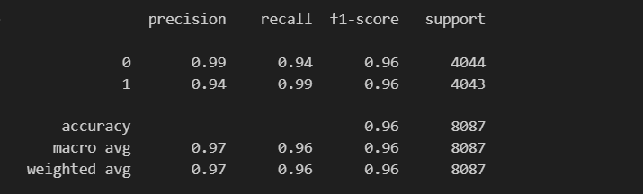
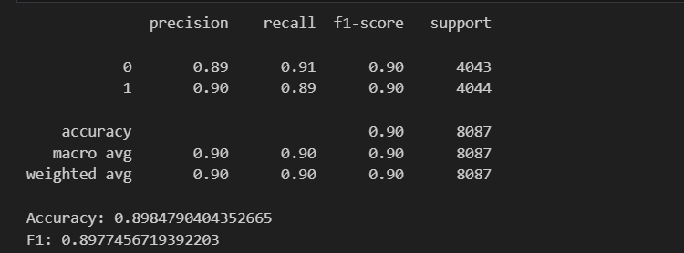

# Fake Review Detection System

By Aditya Dhawan, DTU

A machine learning application that classifies reviews as:

- Original Human Review
- Computer Generated Review

## Models: DistilBERT & TF-IDF Logistic Regression

DistilBERT weights hosted on Hugging Face:
https://huggingface.co/adityadhawan/FAKE-REVIEW-DETECTION-DistilBERT

DistilBERT - 96.0% Confidence

TF-IDF + Logistic Regression - 89.85% Confidence

## DistilBERT Confusion Matrix

---

## TF-IDF + Logistic Regression Confusion Matrix

## Features
- Real-time review classification
- Multiple model support
- Confidence score display
- Hugging Face integration
- Streamlit web interface

## Demo

[Streamlit App Link]

